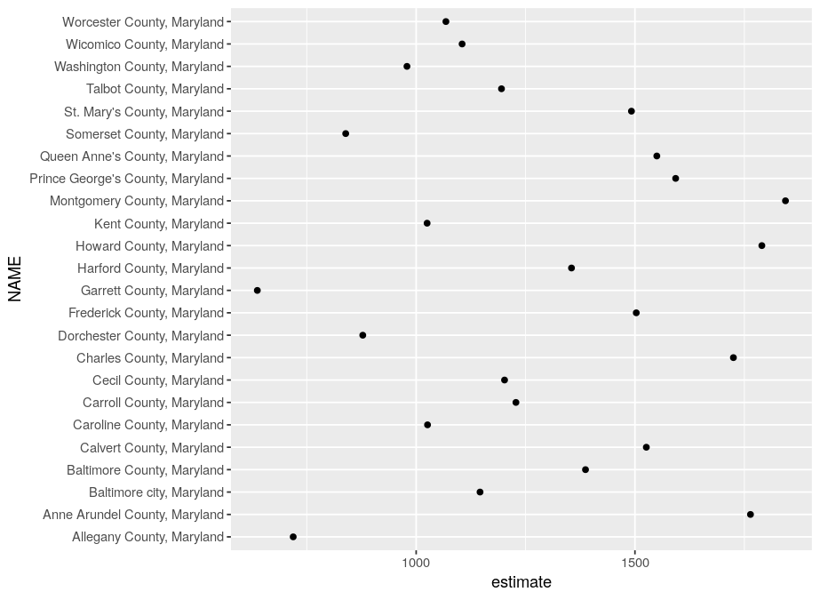
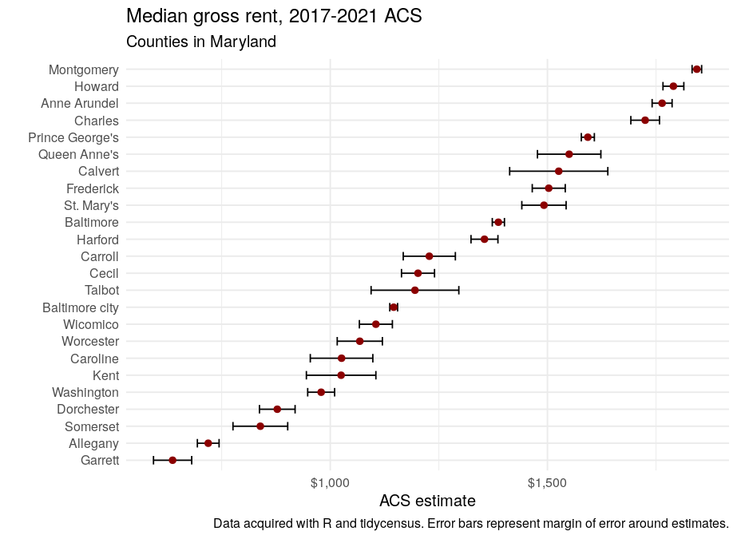

```{r setup, include=FALSE}
options(htmltools.dir.version = FALSE)
options(tigris_use_cache = TRUE)
library(tidycensus)
library(scales)


knitr::opts_chunk$set(message = FALSE, warning = FALSE)
```

```{r xaringan-themer, include=FALSE, warning=FALSE}
library(xaringanthemer)

style_xaringan(
  title_slide_background_color = "#035004",
  text_color = "black",
  header_color = "#035004",
  inverse_background_color = "#035004",
  text_font_family = "Gotham Narrow",
  header_font_family = "Helvetica",
  header_font_weight = "bold",
  link_color = "#1a730f",
  code_inline_color = "#035004"
)
```

## About me

.pull-left[

* Associate Professor of Geography at TCU 

* Spatial data science researcher and consultant

* Package developer: __tidycensus__, __tigris__, __mapboxapi__, __crsuggest__, __idbr__ (R), __pygris__ (Python)

* Book: [_Analyzing US Census Data: Methods, Maps and Models in R_](https://walker-data.com/census-r/)
  - Print release date February 16
  - To support these workshops: [buy on Amazon](https://www.amazon.com/Analyzing-US-Census-Data-Methods/dp/1032366443) or [direct from CRC Press](https://www.routledge.com/Analyzing-US-Census-Data-Methods-Maps-and-Models-in-R/Walker/p/book/9781032366449)

]

.pull-right[


]

---

## SSDAN workshop series

* Today: Working with the 2021 American Community Survey with R and tidycensus

* Next Wednesday (February 15): Mapping and spatial analysis with ACS data in R

* Wednesday, February 22: Working with geographic data and making maps in Python

---

## Today's agenda

* Hour 1: The American Community Survey, R, and tidycensus

* Hour 2: Analysis and visualization of ACS data with tidyverse tools

* Hour 3: An introduction to ACS microdata

---
class: middle, center, inverse

## Part 1: The American Community Survey, R, and tidycensus

---

## The American Community Survey

* Annual survey of 3.5 million US households 

* Covers topics not available in decennial US Census data (e.g. income, education, language, housing characteristics)

* Available as 1-year estimates (for geographies of population 65,000 and greater) and 5-year estimates (for geographies down to the block group)
  - 2020 1-year data only available as [experimental estimates](https://www.census.gov/programs-surveys/acs/data/experimental-data.html)

* Data delivered as _estimates_ characterized by _margins of error_

---

## How to get ACS data

* [data.census.gov](https://data.census.gov) is the main, revamped interactive data portal for browsing and downloading Census datasets, including the ACS

* [The US Census __A__pplication __P__rogramming __Interface__ (API)](https://www.census.gov/data/developers/data-sets.html) allows developers to access Census data resources programmatically

---

## tidycensus

* R interface to the Decennial Census, American Community Survey, Population Estimates Program, and Public Use Microdata Series APIs

* Key features: 
  - Wrangles Census data internally to return tidyverse-ready format (or traditional wide format if requested);
  
  - Automatically downloads and merges Census geometries to data for mapping (next week's workshop!); 
  
  - Includes tools for handling margins of error in the ACS and working with survey weights in the ACS PUMS;
  
  - States and counties can be requested by name (no more looking up FIPS codes!)
  
---

## R and RStudio

* R: programming language and software environment for data analysis (and wherever else your imagination can take you!)

* RStudio: integrated development environment (IDE) for R developed by [Posit]()

* Posit Cloud: run RStudio with today's workshop pre-configured

---

## Getting started with tidycensus

* To get started, install the packages you'll need for today's workshop

* If you are using the Posit Cloud environment, these packages are already installed for you

```{r install-packages, eval = FALSE}
install.packages(c("tidycensus", "tidyverse"))
```

* Optional, to run advanced examples:

```{r advanced-packages, eval = FALSE}
install.packages(c("mapview", "plotly", "ggiraph", 
                   "survey", "srvyr"))
```

---

## Optional: your Census API key

* tidycensus (and the Census API) can be used without an API key, but you will be limited to 500 queries per day

* Power users: visit https://api.census.gov/data/key_signup.html to request a key, then activate the key from the link in your email. 

* Once activated, use the `census_api_key()` function to set your key as an environment variable

```{r api-key, eval = FALSE}
library(tidycensus)

census_api_key("YOUR KEY GOES HERE", install = TRUE)
```

---
class: middle, center, inverse

## Getting started with ACS data in tidycensus

---

## Using the `get_acs()` function

* The `get_acs()` function is your portal to access ACS data using tidycensus

* The two required arguments are `geography` and `variables`.  The function defaults to the 2017-2021 5-year ACS

```{r acs}
library(tidycensus)

median_income <- get_acs(
  geography = "county",
  variables = "B19013_001",
  year = 2021
)
```

---

* ACS data are returned with five columns: `GEOID`, `NAME`, `variable`, `estimate`, and `moe`

```{r view-acs}
median_income
```

---

## 1-year ACS data

* 1-year ACS data are more current, but are only available for geographies of population 65,000 and greater

* Access 1-year ACS data with the argument `survey = "acs1"`; defaults to `"acs5"`

```{r acs-1-year}
median_income_1yr <- get_acs(
  geography = "county",
  variables = "B19013_001",
  year = 2021,
  survey = "acs1" #<<
)
```

---

* ACS data are returned with five columns: `GEOID`, `NAME`, `variable`, `estimate`, and `moe`

```{r view-acs-1yr}
median_income_1yr
```

---

## Requesting tables of variables

* The `table` parameter can be used to obtain all related variables in a "table" at once

```{r census-table}
income_table <- get_acs(
  geography = "county", 
  table = "B19001", #<<
  year = 2021
)
```

---

```{r view-table}
income_table
```

---
class: middle, center, inverse

## Understanding geography and variables in tidycensus

---

## US Census Geography


.footnote[Source: [US Census Bureau](https://www2.census.gov/geo/pdfs/reference/geodiagram.pdf)]

---

## Geography in tidycensus

* Information on available geographies, and how to specify them, can be found [in the tidycensus documentation](https://walker-data.com/tidycensus/articles/basic-usage.html#geography-in-tidycensus-1)


---

## Querying by state

.pull-left[

* For geographies available below the state level, the `state` parameter allows you to query data for a specific state

* For smaller geographies (Census tracts, block groups), a `county` can also be requested

* __tidycensus__ translates state names and postal abbreviations internally, so you don't need to remember the FIPS codes!

* Example: data on median household income in Minnesota by county

]

.pull-right[

```{r query-by-state}
mn_income <- get_acs(
  geography = "county", 
  variables = "B19013_001", 
  state = "MN", #<<
  year = 2021
)
```

]

---

```{r show-query-by-state}
mn_income
```

---

## Searching for variables

* To search for variables, use the `load_variables()` function along with a year and dataset

* The `View()` function in RStudio allows for interactive browsing and filtering

```{r search-variables, eval = FALSE}
vars <- load_variables(2021, "acs5")

View(vars)

```

---

## Available ACS datasets in tidycensus

* Detailed Tables 

* Data Profile (add `"/profile"` for variable lookup)

* Subject Tables (add `"/subject"`)

* Comparison Profile (add `"/cprofile"`)

* Supplemental Estimates (use `"acsse"`)

* Migration Flows (access with `get_flows()`)

---
class: middle, center, inverse

## Data structure in tidycensus

---

## "Tidy" or long-form data

.pull-left[

* The default data structure returned by __tidycensus__ is "tidy" or long-form data, with variables by geography stacked by row

]

.pull-right[


```{r tidy-data}
age_sex_table <- get_acs(
  geography = "state", 
  table = "B01001", 
  year = 2021,
  survey = "acs1",
)

```

]

---

```{r show-tidy-data}
age_sex_table
```


---

## "Wide" data 

.pull-left[

* The argument `output = "wide"` spreads Census variables across the columns, returning one row per geographic unit and one column per variable

]

.pull-right[

```{r wide-data}
age_sex_table_wide <- get_acs(
  geography = "state", 
  table = "B01001", 
  year = 2021,
  survey = "acs1",
  output = "wide" #<<
)
```

]

---

```{r show-wide-data}
age_sex_table_wide
```


---

## Using named vectors of variables

.pull-left[

* Census variables can be hard to remember; using a named vector to request variables will replace the Census IDs with a custom input

* In long form, these custom inputs will populate the `variable` column; in wide form, they will replace the column names

]

.pull-right[


```{r named-variables}
ca_education <- get_acs(
  geography = "county",
  state = "CA",
  variables = c(percent_high_school = "DP02_0062P", #<<
                percent_bachelors = "DP02_0065P",
                percent_graduate = "DP02_0066P"), #<<
  year = 2021
)
```

]

---

```{r show-named-variables}
ca_education
```


---

## Part 1 exercises

1. Review the available geographies in tidycensus from the tidycensus documentation.  Acquire data on total households (variable `H1_001N`) for a geography we have not yet used.  

2. Use the `load_variables()` function to find a variable that interests you that we haven't used yet.  Use `get_decennial()` to fetch data from the 2020 Census for counties in a state of your choosing.

---
class: middle, center, inverse

## Part 2: Analyzing and visualizing ACS data

---

## The tidyverse

```{r tidyverse}
library(tidyverse)

tidyverse_logo()
```

* The [tidyverse](https://tidyverse.tidyverse.org/index.html): an integrated set of packages developed primarily by Hadley Wickham and the RStudio team

---

## tidycensus and the tidyverse

* Census data are commonly used in _wide_ format, with categories spread across the columns

* tidyverse tools work better with [data that are in "tidy", or _long_ format](https://vita.had.co.nz/papers/tidy-data.pdf); this format is returned by tidycensus by default

* Goal: return data "ready to go" for use with tidyverse tools

---
class: middle, center, inverse

## Exploring ACS data with tidyverse tools

---

## Finding the largest values

* dplyr's `arrange()` function sorts data based on values in one or more columns, and `filter()` helps you query data based on column values

* Example: what counties in the US have the lowest and highest median household incomes?

```{r texas-population}
library(tidyverse)

arrange(median_income, estimate)

```

---

```{r sort-ascending}
arrange(median_income, desc(estimate))

```

---

## Refining your analysis with `filter()`

* The `filter()` function subsets data according to a specified condition, much like a SQL query

```{r filter-below-1000}
# Remove Puerto Rico from the median income dataset
income_states_dc <- filter(median_income, !str_detect(NAME, "Puerto Rico"))

arrange(income_states_dc, estimate)

```

---
class: middle, center, inverse

## Group-wise Census data analysis

---

## Group-wise Census data analysis

* The `group_by()` and `summarize()` functions in dplyr are used to implement the split-apply-combine method of data analysis

* The default "tidy" format returned by tidycensus is designed to work well with group-wise Census data analysis workflows

---

## What is the highest-income county in each state?

```{r largest-group}
highest_incomes <- median_income %>%
  separate(NAME, into = c("county", "state"), sep = ", ") %>% #<<
  group_by(state) %>% #<<
  filter(estimate == max(estimate)) #<<
```

---

```{r view-largest-group}
highest_incomes
```

---
class: middle, center, inverse

## Visualizing ACS data

---

## Visualizing ACS estimates

* As opposed to decennial US Census data, ACS estimates include information on uncertainty, represented by the _margin of error_ in the `moe` column

* This means that in some cases, visualization of estimates without reference to the margin of error can be misleading

* Walkthrough: building a margin of error visualization with __ggplot2__

---

## Visualizing ACS estimates

* Let's get some data on median gross rent by county in Maryland

```{r nj-income}
md_rent <- get_acs(
  geography = "county",
  variables = "B25031_001",
  state = "MD",
  year = 2021
) 
```

---

## A basic plot

* To visualize a dataset with __ggplot2__, we define an _aesthetic_ and a _geom_

```{r md-basic-plot, eval = FALSE}
ggplot(md_rent, aes(x = estimate, y = NAME)) + 
  geom_point()
```

---

```{r md-basic-plot-show, echo = FALSE, out.width="800px"}

```


---

## Problems with our basic plot

* The data are not sorted by value, making comparisons difficult

-- 

* The axis and tick labels are not intuitive

-- 

* The Y-axis labels contain repetitive information (" County, Maryland")

---

## Sorting by value

* We use `reorder()` to sort counties by the value of their ACS estimates, improving legibility

```{r md-plot-sorted}
md_plot <- ggplot(md_rent, aes(x = estimate, 
                                y = reorder(NAME, estimate))) + #<<
  geom_point(color = "darkred", size = 2)
```

---

```{r second-plot, echo = FALSE, out.width = "800px"}
knitr::include_graphics("img/second-plot.png")
```


---

## Cleaning up tick labels

* Using a combination of functions in the __scales__ package and custom-defined functions, tick labels can be formatted any way you want

```{r md-plot-labels-cleaned}
library(scales)

md_plot <- md_plot + 
  scale_x_continuous(labels = label_dollar()) + #<<
  scale_y_discrete(labels = function(x) str_remove(x, " County, Maryland|, Maryland")) #<<
```

---

```{r third-plot, echo = FALSE, out.width = "800px"}
knitr::include_graphics("img/third-plot.png")
```


---

## Improving formatting and theming

* Use `labs()` to label the plot and its axes, and change the theme to one of several built-in options

```{r md-plot-formatted}
md_plot <- md_plot + 
  labs(title = "Median gross rent, 2017-2021 ACS",
       subtitle = "Counties in Maryland",
       caption = "Data acquired with R and tidycensus",
       x = "ACS estimate",
       y = "") + 
  theme_minimal(base_size = 12)
```

---

```{r fourth-plot, echo = FALSE, out.width = "800px"}
knitr::include_graphics("img/fourth-plot.png")
```


## Problem: comparing ACS estimates

* The chart suggests that Calvert County has lower rent than Prince George's County and higher rent than St. Mary's, but its margin of error is quite large

```{r head-nj-income}
md_rent %>%
  arrange(desc(estimate)) %>%
  slice(5:9)
```

* How to visualize uncertainty in an intuitive way?

---

## Visualizing margins of error

```{r nj-income-errorbar}
md_plot_errorbar <- ggplot(md_rent, aes(x = estimate, 
                                        y = reorder(NAME, estimate))) + 
  geom_errorbar(aes(xmin = estimate - moe, xmax = estimate + moe), #<<
                width = 0.5, linewidth = 0.5) + #<<
  geom_point(color = "darkred", size = 2) + 
  scale_x_continuous(labels = label_dollar()) + 
  scale_y_discrete(labels = function(x) str_remove(x, " County, Maryland|, Maryland")) + 
  labs(title = "Median gross rent, 2017-2021 ACS",
       subtitle = "Counties in Maryland",
       caption = "Data acquired with R and tidycensus. Error bars represent margin of error around estimates.",
       x = "ACS estimate",
       y = "") + 
  theme_minimal(base_size = 12)
```


---

```{r error-plot, echo = FALSE, out.width = "800px"}

```

---
class: middle, center, inverse

## Making plots interactive


---

## Quick interactivity with `ggplotly()`

* The __plotly__ R package is an interface to the Plotly JavaScript library for full-featured interactive plotting

* Resource: [_Interactive web-based data visualization with R, plotly, and Shiny](https://plotly-r.com/)

* `ggplotly()` automatically converts __ggplot2__ graphics to interactive charts

```{r plotly-plot, eval = FALSE}
library(plotly)

ggplotly(md_plot_errorbar, tooltip = "x")
```

---

```{r include-plotly, echo = FALSE, out.width = "800px"}
knitr::include_url("img/md_plotly.html")
```


---

## Interactivity with __ggiraph__

* __ggiraph__: Alternative approach for making __ggplot2__ graphics interactive

* Includes `*_interactive()` versions of __ggplot2__ geoms that can bring chart elements to life

* Next week: we'll use __ggiraph__ for interactive mapping!

---

## __ggiraph__ example

```{r ggiraph-code, eval = FALSE}
library(ggiraph)

md_plot_ggiraph <- ggplot(md_rent, aes(x = estimate, 
                                       y = reorder(NAME, estimate),
                                       tooltip = estimate, #<<
                                       data_id = GEOID)) + #<<
  geom_errorbar(aes(xmin = estimate - moe, xmax = estimate + moe), 
                width = 0.5, size = 0.5) + 
  geom_point_interactive(color = "darkred", size = 2) + #<<
  scale_x_continuous(labels = label_dollar()) + 
  scale_y_discrete(labels = function(x) str_remove(x, " County, Maryland|, Maryland")) + 
  labs(title = "Median gross rent, 2017-2021 ACS",
       subtitle = "Counties in Maryland",
       caption = "Data acquired with R and tidycensus. Error bars represent margin of error around estimates.",
       x = "ACS estimate",
       y = "") + 
  theme_minimal(base_size = 12)

girafe(ggobj = md_plot_ggiraph) %>% #<<
  girafe_options(opts_hover(css = "fill:cyan;")) #<<
```

---

## Saving interactive plots

.pull-left[

* To save an interactive plot to a standalone HTML file for display on your website, use the `saveWidget()` function in the __htmlwidgets__ package

]

.pull-right[

```{r save-widget, eval = FALSE}
library(htmlwidgets)

plotly_plot <- ggplotly(md_plot_errorbar, tooltip = "x")

saveWidget(plotly_plot, file = "md_plotly.html")

```


]

---

## Part 2 exercises

Swap in a variable from Part 1, `"DP02_0066P"` (percent with a graduate degree) for the analysis in this section.  Find out answers to the following questions:

* Which counties in the US have the largest percentages of graduate degree holders?

* Which have the smallest percentages?

* For a state of your choosing, which county in your state has the highest percentage?

__Challenge, if time__: make a margin of error plot for the state you've chosen. Does this method work well for your state?

---
class: middle, center, inverse

## Part 3: Working with ACS microdata

---

## What is "microdata?"  

* __Microdata__: individual-level survey responses made available to researchers 

* [The ACS Public Use Microdata Series (PUMS)](https://www.census.gov/programs-surveys/acs/microdata.html) allows for detailed cross-tabulations not available in aggregated data

* The 1-year PUMS covers about 1 percent of the US population; the 5-year PUMS covers about 5 percent (so, not the full ACS)

* Data downloads available [in bulk from the Census FTP server](https://www2.census.gov/programs-surveys/acs/data/pums/2019/5-Year/) or [from data.census.gov's MDAT tool](https://data.census.gov/mdat/#/search?ds=ACSPUMS5Y2019)

* Other resource for cleaned, time-series microdata: IPUMS


---
class: middle, center, inverse

## Using microdata in tidycensus

---

## Basic usage of `get_pums()`

.pull-left[

* `get_pums()` requires specifying one or more variables and the state for which you'd like to request data.  `state = 'all'` _can_ get data for the entire USA, but it takes a while!

* The function defaults to the 5-year ACS with `survey = "acs5"`; 1-year ACS data is available with `survey = "acs1"`. 

* The default year is 2021 in the latest version of tidycensus; data are available back to 2005 (1-year ACS) and 2005-2009 (5-year ACS). 2020 1-year data are not available.

]


.pull-right[

```{r first-call, results = 'hide'}
library(tidycensus)

hi_pums <- get_pums(
  variables = c("SEX", "AGEP", "HHT"),
  state = "HI",
  survey = "acs1",
  year = 2021
)
```

]

---

```{r}
hi_pums
```

---

## Understanding default data from `get_pums()`

`get_pums()` returns some technical variables by default without the user needing to request them specifically.  These include: 

* `SERIALNO`: a serial number that uniquely identifies households in the sample; 

* `SPORDER`: the order of the person in the household; when combined with `SERIALNO`, uniquely identifies a person;

* `WGTP`: the household weight;

* `PWGTP`: the person weight

---

## Weights and ACS microdata

* Given that PUMS data are a _sample_ of the US population, the weights columns must be used for analysis

```{r tabulate}
library(tidyverse)

hi_age_39 <- filter(hi_pums, AGEP == 39)

print(sum(hi_pums$PWGTP))
print(sum(hi_age_39$PWGTP))
```

---

## Are these estimates accurate?

* PUMS weights are calibrated to population and household totals, so larger tabulations should align with published estimates

```{r check-hawaii}
get_acs("state", "B01003_001", state = "HI", survey = "acs1", year = 2021)
```

* Smaller tabulations will be characterized by more uncertainty, and may deviate from published estimates

---
class: middle, center, inverse

## Working with PUMS variables

---

## Variables available in the ACS PUMS

```{r view, eval = FALSE}
View(pums_variables)
```

* The `pums_variables` dataset is your one-stop shop for browsing variables in the ACS PUMS

* It is a long-form dataset that organizes specific _value codes_ by variable so you know what you can get.  You'll use information in the `var_code` column to fetch variables, but pay attention to the `var_label`, `val_code`, `val_label`, and `data_type` columns

---

## Recoding PUMS variables

.pull-left[

* The `recode = TRUE` argument in `get_pums()` appends recoded columns to your returned dataset based on information available in `pums_variables`

]

.pull-right[

```{r recode, results = 'hide'}
hi_pums_recoded <- get_pums(
  variables = c("SEX", "AGEP", "HHT"),
  state = "HI",
  survey = "acs1",
  year = 2021,
  recode = TRUE
)
```

]

---

```{r show-recode}
hi_pums_recoded
```

---

## Using variables filters

.pull-left[

* PUMS datasets - especially from the 5-year ACS - can get quite large.  The `variables_filter` argument can return a subset of data from the API, reducing long download times


]

.pull-right[

```{r filter, results = 'hide'}
hi_pums_filtered <- get_pums(
  variables = c("SEX", "AGEP", "HHT"),
  state = "HI",
  survey = "acs5",
  variables_filter = list(
    SEX = 2,
    AGEP = 30:49
  ),
  year = 2021
)
```


]

---

```{r show-filter}
hi_pums_filtered
```


---
class: middle, center, inverse

## Public Use Microdata Areas (PUMAs)

---

## What is a PUMA?

* Public Use Microdata Areas (PUMAs) are the smallest available geographies at which records are identifiable in the PUMS datasets

* PUMAs are redrawn with each decennial US Census, and typically are home to 100,000-200,000 people. The 2021 ACS uses 2010 PUMAs; the 2022 ACS will align with the new 2020 PUMAs

* In large cities, a PUMA will represent a collection of nearby neighborhoods; in rural areas, it might represent several counties across a large area of a state

* Let's preview some of next week's spatial tools to understand PUMA geography in Hawaii

---

```{r plot-pumas}
library(tigris)
library(mapview)
options(tigris_use_cache = TRUE)

# Get the latest version of 2010 PUMAs
hi_pumas <- pumas(state = "HI", cb = TRUE, year = 2019)

hi_puma_map <- mapview(hi_pumas)
```

---

```{r mapview-pumas}
hi_puma_map
```


---

## Working with PUMAs in PUMS data

* To get PUMA information in your output data, use the variable code `PUMA`

```{r get-pumas, results = 'hide'}
hi_age_by_puma <- get_pums(
  variables = c("PUMA", "AGEP"),
  state = "HI",
  survey = "acs5"
)
```

---

```{r show-pumas}
hi_age_by_puma
```


---
class: middle, center, inverse

## Handling uncertainty in tabulated PUMS estimates

---

## Uncertainty in PUMS data

* PUMS data represent a smaller sample than the regular ACS, so understanding error around tabulated estimates is critical

* [The Census Bureau recommends using _successive difference replication_](https://www2.census.gov/programs-surveys/acs/tech_docs/pums/ACS2015_2019_PUMS_README.pdf) to calculate standard errors, and provides _replicate weights_ to do this

* __tidycensus__ includes tools to help you get replicate weights and format your data for appropriate survey-weighted analysis

---

## Getting replicate weights

* We can acquire either housing or person replicate weights with the `rep_weights` argument

```{r hi-rep-weights, results = 'hide'}
hi_pums_replicate <- get_pums(
  variables = c("AGEP", "PUMA"),
  state = "HI",
  survey = "acs1",
  year = 2021,
  rep_weights = "person" #<<
)

```

---

```{r hi-rep-weights-show}
hi_pums_replicate
```

---

## Handling complex survey samples

* __tidycensus__ links to the __survey__ and __srvyr__ packages for managing PUMS data as complex survey samples

* The `to_survey()` function will format your data with replicate weights for correct survey-weighted estimation

```{r hi-to-survey}
hi_survey <- to_survey(
  hi_pums_replicate,
  type = "person"
)

class(hi_survey)
```

---

## Survey-weighted tabulations

* __srvyr__ conveniently links R's survey infrastructure to familiar tidyverse-style workflows

* Standard errors can be multiplied by 1.645 to get familiar 90% confidence level margins of error

```{r}
library(srvyr)

hi_survey %>%
  filter(AGEP == 39) %>%
  survey_count() %>%
  mutate(n_moe = n_se * 1.645)
```

---

## Group-wise survey data analysis

* A familiar group-wise tidyverse workflow can be applied correctly by __srvyr__ for the calculation of medians and other summary statistics

```{r}
hi_survey %>%
  group_by(PUMA) %>%
  summarize(median_age = survey_median(AGEP)) %>%
  mutate(median_age_moe = median_age_se * 1.645)
```

---

## Checking our answers

* Tabulated median ages are not identical to published estimates, but are very close

* Use published estimates if available; use PUMS data to generate estimates that aren't available in the published tables

```{r}
hi_age_puma <- get_acs(
  geography = "puma",
  variables = "B01002_001",
  state = "HI",
  year = 2021,
  survey = "acs1"
)
```

---

class: middle, center, inverse

## Hope to see you next week!
