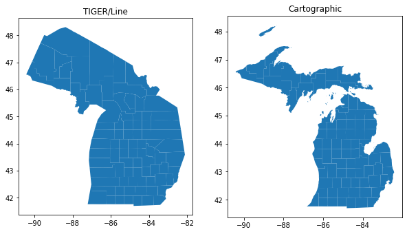

```{r xaringan-themer, include=FALSE, warning=FALSE}
library(xaringanthemer)

style_xaringan(
  title_slide_background_color = "#035004",
  text_color = "black",
  header_color = "#035004",
  inverse_background_color = "#035004",
  text_font_family = "Gotham Narrow",
  header_font_family = "Helvetica",
  header_font_weight = "bold",
  link_color = "#1a730f",
  code_inline_color = "#035004"
)

knitr::opts_chunk$set(echo = FALSE)
```

## About me

.pull-left[

* Associate Professor of Geography at TCU 

* Spatial data science researcher and consultant

* Package developer: __tidycensus__, __tigris__, __mapboxapi__, __crsuggest__, __idbr__ (R), __pygris__ (Python)

* Book: [_Analyzing US Census Data: Methods, Maps and Models in R_](https://walker-data.com/census-r/)
  - Just released on February 16!
  - To support these workshops: [buy on Amazon](https://www.amazon.com/Analyzing-US-Census-Data-Methods/dp/1032366443) or [direct from CRC Press](https://www.routledge.com/Analyzing-US-Census-Data-Methods-Maps-and-Models-in-R/Walker/p/book/9781032366449)

]

.pull-right[


]

---

## SSDAN workshop series

* February 8: [Working with the 2021 American Community Survey with R and tidycensus](https://walker-data.com/umich-workshop-2023/acs-2021/#1)

* Last week (February 15): [Mapping and spatial analysis with ACS data in R](https://walker-data.com/umich-workshop-2023/spatial-data/#1)

* Today (February 22): [Spatial Census data and mapping in Python](https://walker-data.com/umich-workshop-2023/python/#1)

---

## Today's agenda

* Hour 1: An introduction to spatial data in Python

* Hour 2: Finding data and making maps in Python

* Hour 3: Doing GIS and spatial data analysis in Python

---

## Getting set up with Python

The _easiest_ way to follow along with today's workshop is to use Google Colab.  Access notebooks for each Part from the following links:

* [Part 1: An introduction to spatial data in Python](https://colab.research.google.com/drive/1IVQ1phTj2IlgYqIhz41jIepVe49fYnXR?usp=sharing)

* [Part 2: Finding data and making maps in Python](https://colab.research.google.com/drive/1lmXZwTFwSl5yZAfSRiOS8MNRDVz7eeci?usp=sharing)

* [Part 3: Doing GIS and spatial data analysis in Python](https://colab.research.google.com/drive/1DbGEqd0PqVXjQ_BEyooBkDKh5IRE7FeW?usp=sharing)

Advanced users can clone the repository and build a conda environment using the `environment.yml` file in the `python` folder:

```bash
conda env create -f environment.yml
conda activate ssdan-python
```


---
class: middle, center, inverse

## Part 1: An introduction to spatial data in Python

---

## PyData: Python for data science


.footnote[Image source: [Coiled](https://www.coiled.io/blog/pydata-dask#:~:text=The%20PyData%20stack%20for%20scientific,of%20industries%20and%20academic%20research.)]

---

## GeoPandas


* GeoPandas provides extensions to Pandas to allow for geographic data handling

* It is a _comprehensive_ package that helps you perform most core GIS tasks seamlessly in Python!

* Core data structure: the _GeoDataFrame_

---

## The TIGER/Line shapefiles

.pull-left[


]

.pull-right[

* TIGER: Topologically Integrated Geographic Encoding and Referencing database

* High-quality series of geographic datasets released by the US Census Bureau

* Distributed as _shapefiles_, a common GIS data format comprised of several related files

]

.footnote[Image source: [US Census Bureau](https://www2.census.gov/geo/pdfs/maps-data/data/tiger/tgrshp2020/TGRSHP2020_TechDoc.pdf)]


---

## Spatial Census data with __pygris__

* __pygris__: A brand-new Python package I wrote to simplify the process of getting Census shapefiles into your Python projects

* It is a near-feature-complete port of the R __tigris__ package which I've been maintaining for several years

* You can view the documentation at https://walker-data.com/pygris/; let's dive in!


---
class: middle, center, inverse

## Getting started with pygris

---

## How to use pygris

* You can `import pygris` to get access to all its functions, or import specific functions as you need them

* Most functions correspond to a particular Census geographic dataset (like counties)

```python
import pygris

nebraska_counties = pygris.counties(state = "NE")

```
---
class: middle, center, inverse

## Demo: understanding GeoDataFrames

---

## Plotting and viewing data

* GeoPandas includes two main methods for plotting data.  Static plots can be created with `.plot()`: 

```python
nebraska_counties.plot()
```

Interactive, browsable maps can be created with `.explore()`:

```python
nebraska_counties.explore()
```

---

```{r nebraska-counties, out.width="600px"}

```

---

## US Census Geography


.footnote[Source: [US Census Bureau](https://www2.census.gov/geo/pdfs/reference/geodiagram.pdf)]

---

## Datasets available in pygris

* __Legal entities__: units that have legal significance in the US (e.g. states, counties)

* __Statistical entities__: units that are used to tabulate Census data but do not have legal standing (e.g. Census tracts or block groups)

* __Geographic features__: other geographic datasets provided by the Census Bureau that are not used for demographic tabulation (e.g. roads, water)

---

## Example: geographic features (lines)

```python
washtenaw_roads <- pygris.roads(state = "MI", county = "Washtenaw")

washtenaw_roads.plot()
```

---

## Example: statistical entities (polygons)

```python
washtenaw_tracts = pygris.tracts(state = "MI", county = "Washtenaw")

washtenaw_tracts.plot()
```

---

## How pygris works

When you call a pygris function:

* By default, a shapefile corresponding to the function and arguments used will be downloaded from the Census FTP server and read into Python as a GeoDataFrame

* If the argument `cache = True` is used:
  - pygris builds a cache directory and saves the downloaded shapefile there
  - If `cache = True` is used a subsequent time, pygris will look in the cache directory instead of on the Census website for the shapefile so you don't have to re-download it
  - This option is very useful for large files!

---

## TIGER/Line vs. Cartographic Boundary shapefiles

* Question I've received over the years: "Why does Michigan look so weird?"

* The core TIGER/Line shapefiles include _water area_ that belongs to US states and counties

* Use the argument `cb = True` to obtain a _cartographic boundary shapefile_ pre-clipped to the US shoreline

* For some geographies, highly generalized (1:5 million and 1:20 million) shapefiles are available with the `resolution` argument

---

## TIGER/Line vs. Cartographic Boundary shapefiles

```python
import matplotlib.pyplot as plt

# Get the default TIGER/Line file for counties in Michigan
mi_tiger = pygris.counties(state = "MI", cache = True)

# Get the cartographic boundary file with cb = True
mi_cartographic = pygris.counties(state = "MI", cb = True, cache = True)

# Plot the two side-by-side to compare them
fig, ax = plt.subplots(ncols = 2, figsize = (10, 8))
mi_tiger.plot(ax = ax[0])
mi_cartographic.plot(ax = ax[1])

ax[0].set_title("TIGER/Line")
ax[1].set_title("Cartographic")
```

---

```{r compare-cb, out.width = "600px"}

```


---
class: middle, center, inverse

## Working with geometries in pygris

---

## Shifting and rescaling the non-contiguous US

* A common problem when working with US data: how to represent non-contiguous parts of the country?

```python
us = pygris.states(cb = True, resolution = "20m")

us.plot(figsize = (12, 8))
```

---

```{r us_regular, out.width = "800px"}

```

---

## The `shift_geometry()` function

* Use `shift_geometry()` to shift and optionally re-scale Alaska, Hawaii, and Puerto Rico

```python
from pygris.utils import shift_geometry

us_rescaled = shift_geometry(us)

us_rescaled.plot(figsize = (12, 8))
```

* Customize the display with `position` and `preserve_area` arguments

```python
us_shifted = shift_geometry(us, position = "outside", preserve_area = True)

us_shifted.plot(figsize = (12, 8))
```

---

```{r shift-geometry-1, out.width="600px"}

```


---

## Erasing water area

* While CB files are pre-clipped to the US shoreline, they don't always do a great job of representing water-rich areas.  For example:

```python
pinellas_tracts = pygris.tracts("FL", "Pinellas", cb = True)

pinellas_tracts.explore(tooltip = False, popup = True)
```

---

## Erasing water area

* Solution: the `erase_water()` function automates the removal of water areas from your polygons, using the `area_water()` function to acquire data under the hood

* Use the `area_threshold` argument to specify how much water area to remove (higher = only the largest water areas are removed)

```python
from pygris.utils import erase_water

pinellas_erase = erase_water(pinellas_tracts, area_threshold = 0.95)

pinellas_erase.explore(tooltip = False, popup = True)
```

---

## Part 1 exercises

1. Try out pygris! Explore available geographies in the pygris documentation and get data for a state and/or county of your choosing.  Plot the result with `.plot()` or `.explore()`. 

2. Try out all the available combinations of `shift_geometry()`.  Which configuration do you like the best?

---
class: middle, center, inverse

## Part 2: Finding data and making maps in Python

---

## Geographic data visualization in Python

* Many US datasets are aggregated to Census geographic areas, so pygris will fit well within a wide range of data analysis workflows on US topics

* We'll be looking at two mapping use-cases: 
  - Mapping data from the American Community Survey
  - Mapping externally-acquired US election data
  
---

## Finding Census data in Python

* In the previous two workshops, you learned about __tidycensus__, my R package for working with American Community Survey data (and other Census resources)

* I'm not going to write __tidycensus__ for Python.  However, we do have a number of options:
  - [cenpy](https://cenpy-devs.github.io/cenpy/api.html)
  - [census](https://github.com/datamade/census)
  - [CensusData](https://jtleider.github.io/censusdata/)
  - [censusdis](https://github.com/vengroff/censusdis)
  
* If you want to stick with pygris, you can use the `get_census()` function, inspired by the __censusapi__ R package

---

## Step 1: getting Census geographic data

```python
from pygris import tracts

nyc_counties = ["New York", "Bronx", "Richmond", 
                "Kings", "Queens"]

nyc_tracts = tracts(state = "NY", county = nyc_counties, cb = True,
                    year = 2021, cache = True)

nyc_tracts.plot()
```

---

## Step 2: getting demographic data from the ACS

* The `get_census()` function is inspired by the __censusapi__ R package, which can flexibly get data from any Census Bureau API endpoint

```python
from pygris.data import get_census

ny_college = get_census(dataset = "acs/acs5/profile",
                        variables = "DP02_0068PE",
                        year = 2021,
                        params = {
                          "for": "tract:*",
                          "in": "state:36"},
                        guess_dtypes = True,
                        return_geoid = True)
```

---

## How `get_census()` works

* `dataset` is the dataset name on the Census API you are connecting to; find datasets at https://api.census.gov/data.html

* `variables` is a string (or list of strings) representing the variable IDs you want for a given dataset. For the 2021 5-year ACS Data Profile, those variable IDs are found at https://api.census.gov/data/2021/acs/acs5/profile/variables.html.

* `year` is the year of your data (or end-year for a 5-year ACS sample)

* `params` is a dict of query parameters to send to the API. 

* `guess_dtypes` and `return_geoid`: used for some light pre-processing of our data

---

## A first map

* The `plot()` method in GeoPandas can be used to make a choropleth map with minimal code!

```python
nyc_merged = nyc_tracts.merge(ny_college, how = "inner", on = "GEOID")

nyc_merged.plot(column = "DP02_0068PE", legend = True, figsize = (10, 10))
```

---

```{r nyc-map, out.width = "500px"}

```

---

## Improving our plot

* By default, missing values are omitted from the map; we may want to fill them in

* We haven't erased water area from the map, creating a misleading representation of Manhattan (and other areas)

* We may want to choose a different color palette

* The legend colorbar is very large, and the gridlines may not be necessary

* We should add contextual information like a plot title

---

## Improving our plot

```python
from pygris.utils import erase_water
import matplotlib.pyplot as plt

nyc_erase = erase_water(nyc_merged, area_threshold = 0.9)

nyc_erase.plot(column = "DP02_0068PE", legend = True,
               figsize = (10, 10), cmap = "plasma",
               legend_kwds = dict(shrink = 0.5),
               missing_kwds = dict(color = "lightgrey"))

plt.title("Percent with bachelor's degree or higher\nNew York City, 2017-2021 ACS")

ax = plt.gca()

ax.set_axis_off()
```

---

```{r nyc-2, out.width="500px"}

```

---

## Interactive choropleth mapping

* The `.explore()` method, like `.plot()`, can also be customized to make interactive choropleth maps

* Syntax is _similar to_, but not the same as, making maps with `.plot()`

```python
nyc_erase.explore(column = "DP02_0068PE")
```

---

## Customizing interative choropleth maps

* Like `.plot()`, `.explore()` has a wide range of options.  Arguments will differ as they get passed through to the underlying Folium / Leaflet engine

```python
nyc_subset = nyc_erase.filter(["GEOID", "DP02_0068PE", "geometry"])

nyc_subset.explore(column = "DP02_0068PE", cmap = "plasma",
                   tooltip = False, popup = True,
                   tiles = "CartoDB positron",
                   style_kwds = dict(weight = 0.5, nan_fill_color = "lightgrey"),
                   popup_kwds = dict(aliases = ["Census tract", "Percent"]),
                   legend_kwds = dict(caption = "Percent age 25+ with bachelor's degree"))
```

---
class: middle, center, inverse

## Workflow: election mapping

---

## Workflow: election mapping

* Task: make an informative county-level map of the 2020 US Presidential Election results

* It's not as easy as we might think!

* Extended tutorial on data wrangling for visualization and alternative map types for a given topic

---

## Acquiring and merging the data

* We can use a similar workflow to the previous section to make a first map:

```python
from pygris import counties
import pandas as pd

results2020 = pd.read_csv("https://raw.githubusercontent.com/tonmcg/US_County_Level_Election_Results_08-20/master/2020_US_County_Level_Presidential_Results.csv",
                          dtype = {"county_fips": "object"})
                          
results2020['per_dem'] = results2020['per_dem'] * 100
                          
us_counties = counties(cb = True, year = 2020)

us_election = us_counties.merge(results2020, left_on = "GEOID", right_on = "county_fips")

us_election.plot("per_dem", cmap = "RdBu", legend = True, figsize = (10, 8))
```

---

```{r election1, out.width = "750px"}


```

---

## Problems with our map

* Hawaii is distant from the continental United States...

* And Alaska is missing entirely, as it tabulates votes by state legislative district, not by county!

* Workflow: get and clean state legislative districts for Alaska; stitch it together with the remaining US counties; then use `shift_geometry()` for a better map

---

## Wrangling Census geometries

* Task: use pygris to get Alaska House districts, then remove Alaska counties from the counties dataset and replace them with the House districts

```python
from pygris import state_legislative_districts

ak_districts = state_legislative_districts("AK", cb = True, house = "lower", year = 2020)

# We remove Alaska counties from the counties dataset, then align the columns of our data
us_counties_noak = us_counties.query('GEOID != "02"').filter(['GEOID', 'geometry'])
ak_geoid_only = ak_districts.filter(['GEOID', 'geometry'])

# In the election file, Alaska districts start with "029" instead of "020"
ak_geoid_only['GEOID'] = ak_geoid_only['GEOID'].str.replace('020', '029', n = 1)

# Combine spatial datasets with pd.concat()
us_election_counties = pd.concat([us_counties_noak, ak_geoid_only])
```

---

## Merging, shifting, and mapping

```python
from pygris.utils import shift_geometry

us_election_geo = us_election_counties.merge(results2020, left_on = "GEOID", 
                                             right_on = "county_fips")
                                             
us_election_shift = shift_geometry(us_election_geo)

us_election_shift.plot(column = "per_dem", cmap = "RdBu", legend = True, figsize = (20, 15),
                       linewidth = 0.1, legend_kwds = {"shrink": 0.5})
```

---

```{r election2, out.width = "750px"}


```

---

## Does the map work well?

* Problem with election maps: land doesn't vote!

* Solutions: value-by-alpha maps, graduated symbol maps

---

## Value-by-alpha mapping

* Principle: modify the opacity of polygons based on the value of a second variable (e.g., total votes cast)

* Our workflow: calculate a percentile column based on total votes cast, which will be used as a 0 to 1 transparency value (requires matplotlib >= 3.3)

```python
us_election_shift['percentile'] = us_election_shift['total_votes'].rank(pct = True)

us_election_shift.plot(column = "per_dem", cmap = "RdBu", legend = True, figsize = (20, 15),
                       legend_kwds = {"shrink": 0.5}, alpha = us_election_shift['percentile'],
                       linewidth = 0.1)
```

---

```{r electiona, out.width = "750px"}
knitr::include_graphics("img/electionalpha.png")

```

---

## Graduated symbol mapping

* While the value-by-alpha map removes the high-intensity colors from low-population areas, low-population areas still occupy most of the visual space on the map

* A solution is a _graduated symbol map_ in which symbol sizes are proportional to total votes cast

* Method: create a dataset of _centroids_ for each county, and plot those centroids over a base layer of counties as reference

---

## Graduated symbol mapping

```python
# Get the centroids
centers = us_election_shift.copy()
centers['geometry'] = us_election_shift.centroid
centers['votes_scaled'] = centers['total_votes'] / 1000

# Make the map
fig, ax = plt.subplots(figsize = (20, 15))

us_election_shift.plot(color = "lightgrey", ax = ax, linewidth = 0.1)
centers.plot(markersize = "votes_scaled", column = "per_dem", cmap = "RdBu", 
             k = 7, ax = ax, legend = True, alpha = 0.5, legend_kwds = dict(shrink = 0.5))

ax.set_axis_off()
plt.title("2020 Presidential Election Results by County\nValues represent % voting for President Biden; circle sizes relative to total votes cast",
          fontsize = 14)
```

---

```{r election3, out.width = "750px"}


```

---


## Part 2 exercises

Visit https://api.census.gov/data/2021/acs/acs5/profile/variables.html and find another variable from the ACS Data Profile to map.  

* Choose a different state / county configuration (or, keep NYC if you want)

* Swap in your new variable to `get_census()` and try re-producing one of the maps we made

---
class: middle, center, inverse

## Part 3: Doing GIS and spatial data analysis in Python

---

## GIS and spatial data analysis in Python

* Many common GIS tasks are available as GeoDataFrame methods

* For more advanced spatial data analysis tasks, the PySAL suite of packages is best-in-class

* In Part 3, we will:
  - Explore GIS methods with pygris and GeoPandas
  - Solve a territory planning problem with PySAL
  
---
class: middle, center, inverse

## GIS methods with pygris and geopandas

---

## Geocoding

* __Geocoding__: the process of converting a _description of a place_ to _geographic coordinates_

* Typically, that description will be an address

* pygris makes the Census geocoder available in its `geocode` module
  - Advantages: free to use without an API key, returns the Census block of the location along with the longitude / latitude coordinates
  - Disadvantages: uses _street centerlines_ rather than _rooftop_ geocoding, which can lead to a loss in accuracy compared to commercial geocoders
  
---

## Geocoding with pygris

* `geocode.geocode()` returns the longitude and latitude coordinates of an input address along with the Census block; `geocode.geolookup()` returns Census geography for an input longitude / latitude pair

```python
from pygris.geocode import geocode

geocode("426 Thompson St, Ann Arbor MI 48106")
```

---

## Geocoding with pygris

* Use `as_gdf = True` to return a GeoDataFrame that can be mapped

```python
ssdan = geocode("426 Thompson St, Ann Arbor MI 48106", as_gdf = True)

ssdan.explore(marker_type = "marker")
```

---

## Geocoding and custom queries

* `geocode.geocode()` powers custom queries in pygris functions, helping users extract Census shapes within a certain distance of an address

```python
from pygris import tracts

ssdan_tracts = tracts(state = "MI", cb = True, 
                      subset_by = {"426 Thompson St, Ann Arbor MI 48106": 5000})
                      
ssdan_tracts.explore()

```

---

## GIS operations in GeoPandas

* The `subset_by` argument in pygris allows you to retrieve rows that _intersect_ an input shape

* In some cases, you may want more fine-grained control over the rows you return

* Solution: _spatial filtering_ using _spatial predicates_

---

## Finding Census tracts in a metro area

* In Census data analysis, we will commonly want to know what Census tracts fall within a metropolitan area

* This information is not stored in the tract shapefiles directly, and we may not know all the county names within a metro beforehand

* Let's replicate the example given in [Section 7.1 of _Analyzing US Census Data_](https://walker-data.com/census-r/spatial-analysis-with-us-census-data.html#spatial-overlay) using Python

---

## Getting relevant data with pygris

* For a multi-state metro area, we can use a list comprehension to get relevant Census tracts then visualize which tracts fall within a metro area

```python
import pandas as pd
import matplotlib.pyplot as plt
from pygris import core_based_statistical_areas

ks_mo_tracts = pd.concat([tracts(state = x, cb = True) for x in ["KS", "MO"]])

kc_metro = core_based_statistical_areas(cb = True).query("GEOID == '28140'")

fig, ax = plt.subplots(figsize = (10, 10))

ks_mo_tracts.plot(color = "white", edgecolor = "lightgrey", ax = ax)
kc_metro.plot(edgecolor = "red", facecolor = "none", ax = ax)
```

---

```{r kc1, out.width = "700px"}

```

---

## Finding intersecting Census tracts

* Intersecting Census tracts could be found with `subset_by`, or with the `intersects()` method in GeoPandas

```python
kc_intersects = ks_mo_tracts.intersects(kc_metro.geometry.iloc[0])

kc_tracts = ks_mo_tracts.loc[kc_intersects]

fig, ax = plt.subplots(figsize = (10, 10))

kc_tracts.plot(color = "white", edgecolor = "lightgrey", ax = ax)
kc_metro.plot(edgecolor = "red", facecolor = "none", ax = ax)

```

---

```{r kc2, out.width = "400px"}

```

---

## Finding tracts _within_ a metro area

* Given that Census shapefiles from the same year align with one another, we can use `.within()` to cleanly identify Census tracts inside a metro area

```python
kc_within = ks_mo_tracts.within(kc_metro.geometry.iloc[0])

kc_tracts_within = ks_mo_tracts.loc[kc_within]

fig, ax = plt.subplots(figsize = (10, 10))

kc_tracts_within.plot(color = "white", edgecolor = "lightgrey", ax = ax)
kc_metro.plot(edgecolor = "red", facecolor = "none", ax = ax)

```

---

```{r kc3, out.width = "400px"}
knitr::include_graphics("img/kc3.png")
```

---
class: middle, center, inverse

## Advanced example: territory planning in Python

---

## Territory planning / regionalization

* A common use-case for Census data is to identify _coherent territories_ that can be used for social services provision, public health, sales planning, or many other applications

* This can be accomplished in Python with _regionalization_, implemented with PySAL and the spopt package

* Let's produce an example of regionalization adapted from [Section 8.5.2 of _Analyzing US Census Data](https://walker-data.com/census-r/modeling-us-census-data.html#spatial-clustering-regionalization)

---

## Identifying relevant metrics

* Regionalization attempts to generate "regions" that are both _spatially contiguous_ and relatively _homogeneous_ with respect to one or more characteristics

* Let's grab some demographic data using `get_census()` that we can use for our Kansas City tracts.  We'll use the following variables from the Data Profile: 
  - `DP02_0068PE`: Percent age 25+ with a bachelor's degree or higher
  - `DP04_0007PE`: Percent single-family housing
  - `DP05_0018E`: Median age
  
---

## Identifying relevant metrics

```python
from pygris.data import get_census

vars = ["DP02_0068PE", "DP04_0007PE", "DP05_0018E"]

metrics = get_census(dataset = "acs/acs5/profile",
                     variables = vars,
                     year = 2021,
                     params = {
                       "for": "tract:*",
                       "in": "state:20,29"},
                     guess_dtypes = True,
                     return_geoid = True)
```

---

## Preparing the data

* We'll merge the `metrics` dataset to our Kansas City Census tracts dataset

```python
kc_metrics = kc_tracts_within.merge(metrics, on = "GEOID").fillna(0)
```

* Missing values are filled with 0 to avoid _islands_

---

## Defining spatial weights

* We'll use PySAL to define polygon "contiguity" - that is, how Census tracts are determined to neighbor one another

* We are using _queen's case contiguity_ in which tracts are considered to be neighbors if they share at least one vertex

* PySAL's __splot__ package can plot the contiguity weights

```python
from libpysal import weights
from splot.libpysal import plot_spatial_weights

w = weights.contiguity.Queen.from_dataframe(kc_metrics)

plot_spatial_weights(w, kc_metrics)
```

---

```{r weightplot, out.width="400px"}

```

---

## Building and solving the model

* We'll use the SKATER algorithm, implemented in the spopt package for spatial optimization

```python
from spopt.region import Skater
import numpy
numpy.random.seed(1983)

skater_model = Skater(
    kc_metrics,
    w,
    attrs_name = vars,
    n_clusters = 10,
    floor = 10
)

skater_model.solve()
```

---

## Evaluating the model

* We can grab the `labels_` attribute from the solved regionalization model, and add it to our tracts dataset as a column for visualization

```python
kc_metrics['Region'] = skater_model.labels_

kc_metrics.plot(column = "Region", categorical = True, figsize = (8, 10),
                legend = True)
```

---

```{r skater, out.width = "300px"}

```


---
class: middle, center, inverse

## Thank you for attending!

