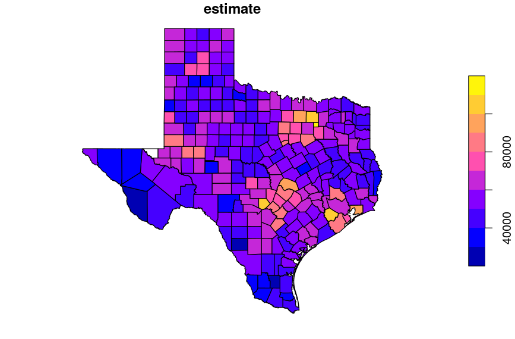
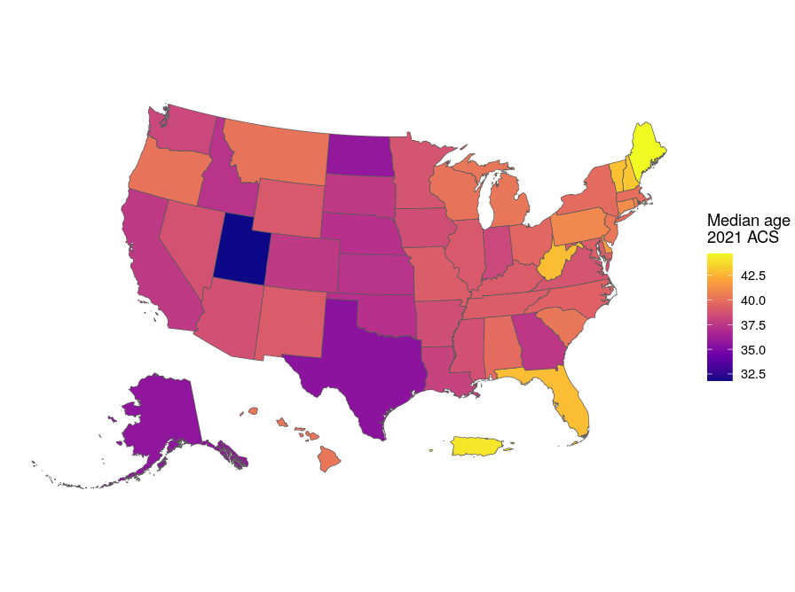

```{r setup, include=FALSE}
options(htmltools.dir.version = FALSE)
options(tigris_use_cache = TRUE)
library(tidycensus)
library(tidyverse)
library(scales)
options(scipen = 999)
sf::sf_use_s2(FALSE)


knitr::opts_chunk$set(message = FALSE, warning = FALSE)

# Data objects needed
texas_income <- get_acs(
  geography = "county",
  variables = "B19013_001",
  state = "TX",
  year = 2021,
  geometry = TRUE
)

king_income <- get_acs(
  geography = "tract",
  variables = "B19013_001",
  state = "WA",
  county = "King",
  geometry = TRUE
)

library(tigris)

king_erase <- erase_water(king_income, 
                          area_threshold = 0.9,
                          year = 2021) 

```

```{r xaringan-themer, include=FALSE, warning=FALSE}
library(xaringanthemer)

style_xaringan(
  title_slide_background_color = "#035004",
  text_color = "black",
  header_color = "#035004",
  inverse_background_color = "#035004",
  text_font_family = "Gotham Narrow",
  header_font_family = "Helvetica",
  header_font_weight = "bold",
  link_color = "#1a730f",
  code_inline_color = "#035004"
)
```

## About me

.pull-left[

* Associate Professor of Geography at TCU 

* Spatial data science researcher and consultant

* Package developer: __tidycensus__, __tigris__, __mapboxapi__, __crsuggest__, __idbr__ (R), __pygris__ (Python)

* Book: [_Analyzing US Census Data: Methods, Maps and Models in R_](https://walker-data.com/census-r/)
  - Print release date February 16 (tomorrow!)
  - To support these workshops: [buy on Amazon](https://www.amazon.com/Analyzing-US-Census-Data-Methods/dp/1032366443) or [direct from CRC Press](https://www.routledge.com/Analyzing-US-Census-Data-Methods-Maps-and-Models-in-R/Walker/p/book/9781032366449)

]

.pull-right[


]

---

## SSDAN workshop series

* Last week (February 8): [Working with the 2021 American Community Survey with R and tidycensus](https://walker-data.com/umich-workshop-2023/acs-2021/#1)

* Today: Mapping and spatial analysis with ACS data in R

* Next week (February 22): Working with geographic data and making maps in Python

---

## Today's agenda

* Hour 1: Working with "spatial" American Community Survey data

* Hour 2: Making maps of ACS data in R

* Hour 3: Applications: segregation, diversity, and location intelligence

---
class: middle, center, inverse

## Part 1: Working with "spatial" American Community Survey data

---

## The American Community Survey

* Annual survey of 3.5 million US households 

* Covers topics not available in decennial US Census data (e.g. income, education, language, housing characteristics)

* Available as 1-year estimates (for geographies of population 65,000 and greater) and 5-year estimates (for geographies down to the block group)
  - 2020 1-year data only available as [experimental estimates](https://www.census.gov/programs-surveys/acs/data/experimental-data.html)

* Data delivered as _estimates_ characterized by _margins of error_

---

## How to get ACS data

* [data.census.gov](https://data.census.gov) is the main, revamped interactive data portal for browsing and downloading Census datasets, including the ACS

* [The US Census __A__pplication __P__rogramming __Interface__ (API)](https://www.census.gov/data/developers/data-sets.html) allows developers to access Census data resources programmatically

---

## tidycensus

* R interface to the Decennial Census, American Community Survey, Population Estimates Program, and Public Use Microdata Series APIs

* Key features: 
  - Wrangles Census data internally to return tidyverse-ready format (or traditional wide format if requested);
  
  - Automatically downloads and merges Census geometries to data for mapping (next week's workshop!); 
  
  - Includes tools for handling margins of error in the ACS and working with survey weights in the ACS PUMS;
  
  - States and counties can be requested by name (no more looking up FIPS codes!)
  
---

## R and RStudio

* R: programming language and software environment for data analysis (and wherever else your imagination can take you!)

* RStudio: integrated development environment (IDE) for R developed by [Posit](https://posit.co/)

* Posit Cloud: run RStudio with today's workshop pre-configured at https://posit.cloud/content/5377428

---

## Getting started with tidycensus

* To get started, install the packages you'll need for today's workshop

* If you are using the Posit Cloud environment, these packages are already installed for you

```{r install-packages, eval = FALSE}
install.packages(c("tidycensus", "tidyverse"))
```

* Optional, to run advanced examples:

```{r advanced-packages, eval = FALSE}
install.packages(c("mapview", "mapedit", "mapboxapi", 
                   "leafsync", "spdep", "segregation",
                   "ggiraph"))
```

---

## Optional: your Census API key

* tidycensus (and the Census API) can be used without an API key, but you will be limited to 500 queries per day

* Power users: visit https://api.census.gov/data/key_signup.html to request a key, then activate the key from the link in your email. 

* Once activated, use the `census_api_key()` function to set your key as an environment variable

```{r api-key, eval = FALSE}
library(tidycensus)

census_api_key("YOUR KEY GOES HERE", install = TRUE)
```

---
class: middle, center, inverse

## Spatial Census data in tidycensus

---

## Spatial Census data: the old way

Traditionally, getting "spatial" Census data requires: 

--

* Fetching shapefiles from the Census website;

--

* Downloading a CSV of data, cleaning/formatting it;

--

* Loading geometries and data into your GIS of choice;

--

* Aligning key fields in your GIS and joining your data

---

## Spatial Census data with `get_acs()`

* The `get_acs()` function is your portal to access ACS data using tidycensus

* The two required arguments are `geography` and `variables`.  The function defaults to the 2017-2021 5-year ACS

* The argument `geometry = TRUE` returns pre-joined geometry along with your ACS data!

```{r acs, eval = FALSE}
library(tidycensus)

texas_income <- get_acs(
  geography = "county",
  variables = "B19013_001",
  state = "TX",
  year = 2021,
  geometry = TRUE
)

plot(texas_income["estimate"])
```

---

```{r view-acs, out.width = "850px", echo = FALSE}

```

---

## Looking under the hood: _simple features_ in R

.pull-left[


]

.pull-right[

* The sf package implements a _simple features data model_ for vector spatial data in R

* Vector geometries: _points_, _lines_, and _polygons_ stored in a list-column of a data frame

]

---

* Spatial data are returned with five data columns: `GEOID`, `NAME`, `variable`, `estimate`, and `moe`, along with a `geometry` column representing the shapes of locations

```{r view-acs-1yr}
texas_income
```

---

## Interactive viewing with `mapview()`

.pull-left[


]

.pull-right[

* The __mapview__ package allows for interactive viewing of spatial data in R

```{r tx-mapview, eval = FALSE}
library(mapview)

mapview(texas_income, zcol = "estimate")
```


]
---

```{r tx-mapview-show, out.width = "850px", echo = FALSE}
knitr::include_url("img/tx_mapview.html", height = "600px")
```

---
class: middle, center, inverse

## Understanding geography and variables in tidycensus

---

## US Census Geography


.footnote[Source: [US Census Bureau](https://www2.census.gov/geo/pdfs/reference/geodiagram.pdf)]

---

## Geography in tidycensus

* Information on available geographies, and how to specify them, can be found [in the tidycensus documentation](https://walker-data.com/tidycensus/articles/basic-usage.html#geography-in-tidycensus-1)


---

## Searching for variables

* To search for variables, use the `load_variables()` function along with a year and dataset

* For the 2021 5-year ACS, use `"acs5"` for the Detailed Tables; `"acs5/profile"` for the Data Profile; `"acs5/subject"` for the Subject Tables; and `"acs5/cprofile"` for the Comparison Profile

* The `View()` function in RStudio allows for interactive browsing and filtering

```{r search-variables, eval = FALSE}
vars <- load_variables(2021, "acs5")

View(vars)

```

---

## Small-area spatial demographic data

* Smaller areas like Census tracts or block groups are available with `geography = "tract"` or `geography = "block group"`; a county can optionally be specified to focus your query

```{r king-income, eval = FALSE}
king_income <- get_acs(
  geography = "tract",
  variables = "B19013_001",
  state = "WA",
  county = "King",
  geometry = TRUE
)

mapview(king_income, zcol = "estimate")
```

---

```{r king-mapview-show, out.width = "850px", echo = FALSE}
knitr::include_url("img/king_mapview.html", height = "600px")
```


---
class: middle, center, inverse

## Spatial data structure in tidycensus

---

## "Tidy" or long-form data

.pull-left[

* The default data structure returned by __tidycensus__ is "tidy" or long-form data, with variables by geography stacked by row

* For spatial data, this means that geometries will also be stacked, which is helpful for group-wise analysis and visualization

]

.pull-right[


```{r tidy-data}
orange_race <- get_acs(
  geography = "tract",
  variables = c(
    Hispanic = "DP05_0071P",
    White = "DP05_0077P",
    Black = "DP05_0078P",
    Asian = "DP05_0080P"
  ),
  state = "CA",
  county = "Orange",
  geometry = TRUE
)

```

]

---

```{r show-tidy-data}
orange_race
```


---

## "Wide" data 

.pull-left[

* The argument `output = "wide"` spreads Census variables across the columns, returning one row per geographic unit and one column per variable

* This will be a more familiar data structure for traditional desktop GIS users

]

.pull-right[

```{r wide-data}
orange_race_wide <- get_acs(
  geography = "tract",
  variables = c(
    Hispanic = "DP05_0071P",
    White = "DP05_0077P",
    Black = "DP05_0078P",
    Asian = "DP05_0080P"
  ),
  state = "CA",
  county = "Orange",
  geometry = TRUE,
  output = "wide" #<<
)
```

]

---

```{r show-wide-data}
orange_race_wide
```


---
class: middle, center, inverse

## Working with Census geometry

---

## Census geometry and the __tigris__ R package

.pull-left[

]

.pull-right[

* tidycensus uses the __tigris__ R package internally to acquire Census shapefiles

* By default, the [Cartographic Boundary shapefiles](https://www.census.gov/geographies/mapping-files/time-series/geo/carto-boundary-file.html) are used, which are pre-clipped to the US shoreline

* tigris offers a number of features to help with acquisition and display of spatial ACS data - I'll highlight one in each part of the workshop!

]

---

## Problem: interior water areas

.pull-left[

* Let's re-visit the King County income-by-Census tract map

* Areas like Mercer Island are obscured as Census tracts cover the entirety of Lake Washington

]

.pull-right[

* `erase_water()` in the __tigris__ package offers a solution; it automates the removal of water areas from your shapes

```{r king-erase, eval = FALSE}
library(tigris)
library(sf)
sf_use_s2(FALSE)

king_erase <- erase_water(king_income, 
                          area_threshold = 0.9, 
                          year = 2021)

mapview(king_erase, zcol = "estimate")
```


]


---

```{r king-erase-show, out.width = "850px", echo = FALSE}
knitr::include_url("img/king_erase.html", height = "600px")
```

---


## Part 1 exercises

1. Use the `load_variables()` function to find a variable that interests you that we haven't used yet.  

2. Use `get_acs()` to fetch spatial ACS data on that variable for a geography and location of your choice, then use `mapview()` to display your data interactively.

---
class: middle, center, inverse

## Part 2: Mapping ACS data

---

## Mapping in R

* R has a robust set of tools for cartographic visualization that make it a suitable alternative to desktop GIS software in many instances

* Popular packages for cartography include __ggplot2__, __tmap__, and __mapsf__

* Today, we'll be focusing on ggplot2; [see Chapter 6 of my book for similar examples using tmap](https://walker-data.com/census-r/)

---

## ggplot2 and `geom_sf()`

* ggplot2: R's most popular visualization package (over 105 million downloads!)

* ggplot2 graphics are defined by an _aesthetic mapping_ and one or more _geoms_

* `geom_sf()` is a special geom that interprets the geometry type of your spatial data and visualizes it accordingly

* As a result, we can make attractive maps using familiar ggplot2 syntax

---
class: middle, center, inverse

## Mapping ACS data with ggplot2

---

## Continuous choropleth

* By default, ggplot2 will apply a continuous color palette to create __choropleth__ maps

* Choropleth maps: the shading of a polygon / shape is mapped to a data attribute

```{r choro1, eval = FALSE}
library(tidyverse)

orange_hispanic <- filter(orange_race, variable == "Hispanic")

ggplot(orange_hispanic, aes(fill = estimate)) + 
  geom_sf()
```

---

```{r choro1-show, out.width = "850px", echo = FALSE}

```


---

## Continuous choropleth with styling

* We can apply some styling to customize our choropleth maps

* Used here: a [viridis](https://cran.r-project.org/web/packages/viridis/vignettes/intro-to-viridis.html) color palette, which is built-in to ggplot2

```{r choro2, eval = FALSE}
ggplot(orange_hispanic, aes(fill = estimate)) + 
  geom_sf() + 
  theme_void() + 
  scale_fill_viridis_c(option = "rocket") + 
  labs(title = "Percent Hispanic by Census tract",
       subtitle = "Orange County, California",
       fill = "ACS estimate",
       caption = "2017-2021 ACS | tidycensus R package")
```

---

```{r choro2-show, out.width = "850px", echo = FALSE}

```


---

## Classed choropleth

* We can also create a binned choropleth; ggplot2 will identify "pretty" breaks, or custom breaks can be supplied

```{r choro3, eval = FALSE}
ggplot(orange_hispanic, aes(fill = estimate)) + 
  geom_sf() + 
  theme_void() + 
  scale_fill_viridis_b(option = "rocket", n.breaks = 6) + 
  labs(title = "Percent Hispanic by Census tract",
       subtitle = "Orange County, California",
       fill = "ACS estimate",
       caption = "2017-2021 ACS | tidycensus R package")
```

---

```{r choro3-show, out.width = "850px", echo = FALSE}
knitr::include_graphics("img/orange-3.png")
```


---

## Faceted choropleth maps

* Spatial ACS data in tidy (long) format can be _faceted_ by a grouping variable, allowing for comparative mapping

```{r facets, eval = FALSE}
ggplot(orange_race, aes(fill = estimate)) + 
  geom_sf(color = NA) + 
  theme_void() + 
  scale_fill_viridis_c(option = "rocket") + 
  facet_wrap(~variable) + #<<
  labs(title = "Race / ethnicity by Census tract",
       subtitle = "Orange County, California",
       fill = "ACS estimate (%)",
       caption = "2017-2021 ACS | tidycensus R package")
```

---

```{r facets-show, out.width = "850px", echo = FALSE}

```


---
class: middle, center, inverse

## Mapping count data

---

## Mapping count data

.pull-left[

* At times, you'll want to show variations in _counts_ rather than rates on your maps of ACS data

* Choropleth maps are poorly suited for count data

* Let's grab some count data for race / ethnicity and consider some alternatives

]

.pull-right[

```{r orange-race-counts}
orange_race_counts <- get_acs(
  geography = "tract",
  variables = c(
    Hispanic = "DP05_0071",
    White = "DP05_0077",
    Black = "DP05_0078",
    Asian = "DP05_0080"
  ),
  state = "CA",
  county = "Orange",
  geometry = TRUE
)
```


]

---

## Graduated symbol maps

.pull-left[

* Graduated symbol maps show difference on a map with the size of symbols (often circles)

* They are better for count data than choropleth maps as the shapes are directly comparable (unlike differentially-sized polygons)

* We'll need to convert our data to _centroids_ to plot graduated symbols in ggplot2

]

.pull-right[

```{r orange-race-centroids}
library(sf)

orange_black <- filter(
  orange_race_counts, 
  variable == "Black"
)

centroids <- st_centroid(orange_black)

```

]

---

## Graduated symbol maps

* We'll first plot a base layer of Census tracts, then a layer of graduated symbols on top

* Use `scale_size_area()` to plot _proportional symbols_

```{r plot-graduated, eval = FALSE}
ggplot() + 
  geom_sf(data = orange_black, color = "black", fill = "lightgrey") + 
  geom_sf(data = centroids, aes(size = estimate),
          alpha = 0.7, color = "navy") + 
  theme_void() + 
  labs(title = "Black population by Census tract",
       subtitle = "2017-2021 ACS, Orange County, California",
       size = "ACS estimate") + 
  scale_size_area(max_size = 6) #<<
```

---

```{r orange-symbols-map, out.width="850px", echo = FALSE}

```


---

## Dot-density mapping

.pull-left[

* It can be difficult to show _heterogeneity_ or _mixing_ of different categories on maps

* Dot-density maps scatter dots proportionally to data size; dots can be colored to show mixing of categories

* Traditionally, dot-density maps are slow to make in R; tidycensus's `as_dot_density()` function addresses this

]

.pull-right[

```{r build-dots}
orange_race_dots <- as_dot_density(
  orange_race_counts,
  value = "estimate",
  values_per_dot = 200,
  group = "variable"
)
```


]


---

```{r show-dots}
orange_race_dots
```

---

## Dot-density mapping

* Like the graduated symbol map, we plot points over a base layer, but in this case with a much smaller size

* Use `override.aes` in `guide_legend()` to plot visible colors in the legend

```{r dot-plot, eval = FALSE}
ggplot() + 
  geom_sf(data = orange_black, color = "lightgrey", fill = "white") + 
  geom_sf(data = orange_race_dots, aes(color = variable), size = 0.01) + #<<
  scale_color_brewer(palette = "Set1") + 
  guides(color = guide_legend(override.aes = list(size = 3))) + #<<
  theme_void() + 
  labs(color = "Race / ethnicity",
       caption = "2017-2021 ACS | 1 dot = approximately 200 people")
```

---

```{r orange-dot-map, out.width="850px", echo = FALSE}

```


---
class: middle, center, inverse

## Interactive mapping and national US maps

---

## Customizing interactive maps with `mapview()`

* `mapview()` accepts custom color palettes and labels, making it a suitable engine for interactive maps for presentations!

```{r mapview-custom, eval = FALSE}
library(viridisLite)

colors <- rocket(n = 100)

mapview(orange_hispanic, zcol = "estimate", 
        layer.name = "Percent Hispanic<br/>2017-2021 ACS",
        col.regions = colors)
```

---

```{r mapview-custom-show, echo = FALSE, out.width="850px"}
knitr::include_url("img/mapview_custom.html", height = "600px")
```

---

## Linked interactive maps with `mapview()`

* In mapview, layers can be stacked with the `+` operator or swiped between with the `|` operator

* __leafsync__ takes this one step further by creating side-by-side synced maps

```{r leafsync, eval = FALSE}
library(leafsync)

orange_white <- filter(orange_race, variable == "White")

m1 <- mapview(orange_hispanic, zcol = "estimate", 
        layer.name = "Percent Hispanic<br/>2017-2021 ACS",
        col.regions = colors)

m2 <- mapview(orange_white, zcol = "estimate", 
        layer.name = "Percent White<br/>2017-2021 ACS",
        col.regions = colors)

sync(m1, m2)
```


---

## Problem: national US maps of the US

* These approaches to a common use-case -- mapping the entirety of the US -- doesn't work well.  Let's take a look:

```{r mapview-mercator, eval = FALSE}
state_age <- get_acs(
  geography = "state",
  variables = "B01002_001",
  year = 2021,
  survey = "acs1",
  geometry = TRUE
)

mapview(state_age, zcol = "estimate",
        col.regions = plasma(7),
        layer.name = "Median age<br/>2021 ACS")
```

---

```{r mapview-mercator-show, echo = FALSE, out.width = "850px"}
knitr::include_url("img/mapview_mercator.html", height = "600px")
```

---

## Solution: shifting and rescaling US geometry

.pull-left[

* The `shift_geometry()` function in the __tigris__ package moves and optionally rescales Alaska, Hawaii, and Puerto Rico to help with national mapping

* `shift_geometry()` includes options to preserve relative position and/or area if desired

]


.pull-right[

```{r shift, eval = FALSE}
library(tigris)

age_shifted <- shift_geometry(state_age)

ggplot(age_shifted, aes(fill = estimate)) + 
  geom_sf() + 
  scale_fill_viridis_c(option = "plasma") + 
  theme_void() + 
  labs(fill = "Median age \n2021 ACS")
```


]

---

```{r shift-show, echo = FALSE, out.width = "800px"}

```


---

## Interactivity with __ggiraph__

* __ggiraph__: Alternative approach for making __ggplot2__ graphics interactive

* Includes `*_interactive()` versions of __ggplot2__ geoms that can bring chart elements to life

* This includes `geom_sf_interactive()`

---

## __ggiraph__ example

```{r ggiraph-code, eval = FALSE}
library(ggiraph)

gg <- ggplot(age_shifted, aes(fill = estimate, data_id = GEOID,
                        tooltip = estimate)) + 
  geom_sf_interactive() + #<<
  scale_fill_viridis_c(option = "plasma") + 
  theme_void() + 
  labs(fill = "Median age\n2021 ACS")


girafe(ggobj = gg) %>% #<<
  girafe_options(opts_hover(css = "fill:cyan;")) #<<
```

---

## Part 2 exercises

Use `load_variables(2021, "acs5/profile")` to find another percentage variable (ends in `P`) from the ACS Data Profile.  Use that variable to try the following:

* Acquire spatial ACS data for your variable and make a customized choropleth map with __ggplot2__

* If time: try converting this map to an interactive map with __ggiraph__ or __mapview__

---
class: middle, center, inverse

## Part 3: Applications: segregation, diversity, and spatial analysis

---
class: middle, center, inverse

## Analyzing segregation and diversity

---

## The dissimilarity index

* The _dissimilarity index_ is one of the most common measures used in the social sciences to calculate segregation

* The statistic reflects the percentage of a group's population that would have to move for _local percentages_ to match the overall percentages of the area

* The index $D$ is calculated as:

$$
D = \frac{1}{2}\sum\limits_{i=1}^{N}\left |\frac{a_i}{A}-\frac{b_i}{B}  \right |
$$

---

## Calculating a dissimilarity index

.pull-left[

* The __segregation__ R package implements the dissimilarity index along with several other commonly-used indices for segregation and diversity

* It works very well with tidycensus and other tidy (long-form) demographic datasets as inputs

]

.pull-right[

```{r calculate-dissimilarity}
library(segregation)

orange_race_counts %>%
  filter(variable %in% c("White", "Hispanic")) %>%
  dissimilarity(
    group = "variable",
    unit = "GEOID",
    weight = "estimate"
  )
```


]

---

## Group-wise segregation analysis

.pull-left[

* Segregation analysis can also be used within tidyverse-style groupwise data analytic workflows

* Here, we'll grab some data for four counties; generate a `county` column for grouping; then use `group_modify()` to calculate groupwise dissimilarity indices (on the next slide)

]

.pull-right[

```{r seg-data-prep}
la_race_counts <- get_acs(
  geography = "tract",
  variables = c(
    Hispanic = "DP05_0071",
    White = "DP05_0077",
    Black = "DP05_0078",
    Asian = "DP05_0080"
  ),
  state = "CA",
  county = c("Orange", "Los Angeles",
             "San Bernardino", "Riverside")
) %>%
  separate(NAME, 
           into = c("state", "county", "tract"),
           sep = ", ")
```

]

---

```{r groupwise-seg}
la_race_counts %>%
  filter(variable %in% c("White", "Hispanic")) %>%
  group_by(county) %>%
  group_modify(
    ~dissimilarity(
      data = .x,
      group = "variable",
      unit = "GEOID",
      weight = "estimate"
    )
  )
```

---

## Analyzing diversity: the entropy index

* As opposed to the dissimilarity index, the _entropy index_ is a measure of evenness between multiple groups.  It is computed as:

$$
E = \sum\limits_{r=1}^{n}Q_rln\frac{1}{Q_r}
$$

* If the natural log is replaced with $log_{k}$ where $k$ is the number of groups, the index will be maximized at 1

---

## Calculating the entropy index

.pull-left[

* The entropy index is implemented in the segregation package with __entropy__

* We'll need to use `group_modify()` to group by Census tract, and combine the results into an output dataset

]


.pull-right[

```{r calculate-entropy}
orange_entropy <- orange_race_counts %>%
  group_by(GEOID) %>%
  group_modify(~tibble(
    entropy = entropy(
      data = .x,
      group = "variable",
      weight = "estimate",
      base = 4
    )
  ))
```


]


---

## Mapping the result

* Let's grab Census tracts directly using the __tigris__ package to make a map

```{r map-entropy, results='hide'}
orange_tracts <- tracts("CA", "Orange", year = 2021, cb = TRUE)

orange_diversity_geo <- left_join(orange_tracts, orange_entropy, by = "GEOID")
```

```{r map-entropy-2, eval = FALSE}
ggplot(orange_diversity_geo, aes(fill = entropy)) + 
  geom_sf() + 
  scale_fill_viridis_c(option = "mako") + 
  theme_void() + 
  labs(fill = "Entropy index")
```

---

```{r map-entropy-show, echo = FALSE, out.width = "850px"}

```


---
class: middle, center, inverse

## Spatial analysis with ACS data

---

## Spatial analysis with ACS data

* __Spatial analysis__: the analysis of data in a way that takes into account, or directly focuses on, the data's spatial properties

* Spatial analysis is a huge topic; read [Chapter 7](https://walker-data.com/census-r/spatial-analysis-with-us-census-data.html) and [Chapter 8](https://walker-data.com/census-r/modeling-us-census-data.html) of my book for a wide variety of examples

* Today's examples: finding neighborhood hot-spots, analyzing demographics within proximity of a site

---

## Spatial analysis: identifying hot-spots

.pull-left[

* The main package for analyzing spatial relationships in R is __spdep__

* We will identify _spatial neighbors_; build a _spatial weights matrix_ from those neighbors; then calculate a hot-spot statistic, the Getis-Ord Local G

]

.pull-right[

```{r calculate-local-G}
library(spdep)

neighbors <- poly2nb(
  orange_diversity_geo, 
  queen = TRUE
)

weights <- nb2listw(neighbors)

G <- localG(
  orange_diversity_geo$entropy, 
  listw = weights
)


```

]

---

## Hot-spot analysis

* As the local G values are z-scores, we can identify critical thresholds for "hot" or "cold" spots and map our results accordingly

```{r map-local-G, eval = FALSE}
orange_localG <- orange_diversity_geo %>%
  mutate(localG = G, 
         Hotspot = case_when(
           localG >= 2.576 ~ "High cluster",
           localG <= -2.576 ~ "Low cluster",
           TRUE ~ "Not significant"
         ))

ggplot(orange_localG, aes(fill = Hotspot)) + 
  geom_sf(color = "grey90") + 
  scale_fill_manual(values = c("red", "blue", "grey")) + 
  theme_void()
```

---

```{r hotspot-map, echo = FALSE, out.width="850px"}

```


---

## Problem: how to get data for a custom area?

* Census data are organized based on Census hierarchies: state, county, etc.

* What if you want data for a custom area that doesn't align with these hierarchies?

* Possible solution: `filter_by`

---
class: middle, center, inverse

## Demo: getting data for a custom shape

---
class: middle, center, inverse

## Demo: getting data around an address

---
class: middle, center, inverse

## Thank you, hope to see you next week!

